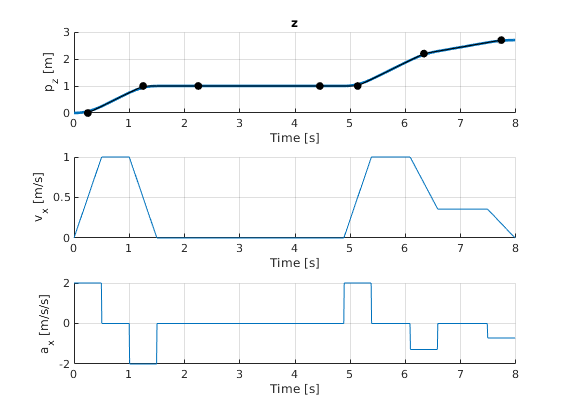
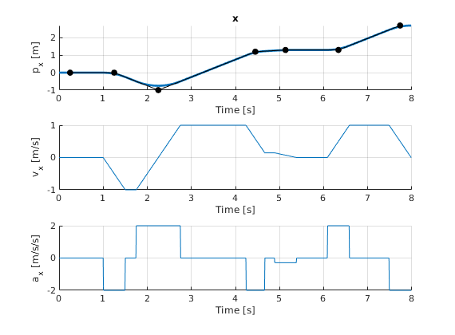
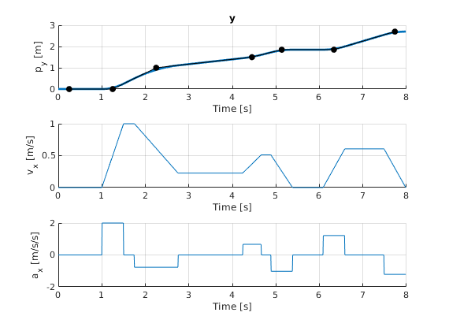

Turning Paths Into Trajectories Using Parabolic Blends
======================================================

Given a set of configuration points, this code generates a trajectory that is kinematically feasible w.r.t max velocity and acceleration constraints.

## Example

## Resources

- [T. Kunz and M. Stilman, GTech 2011 Tech Report](https://smartech.gatech.edu/bitstream/handle/1853/41948/ParabolicBlends.pdf)
